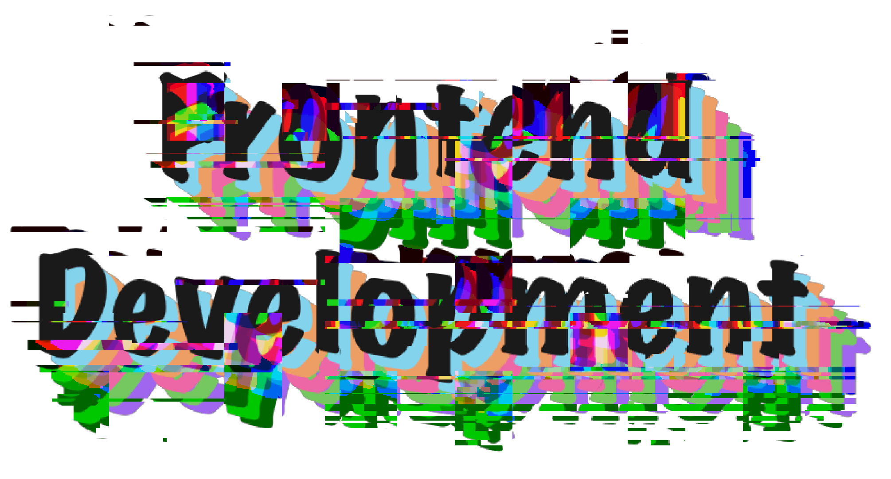

# Procesverslag
Markdown is een simpele manier om HTML te schrijven.  
Markdown cheat cheet: [Hulp bij het schrijven van Markdown](https://github.com/adam-p/markdown-here/wiki/Markdown-Cheatsheet).

Nb. De standaardstructuur en de spartaanse opmaak van de README.md zijn helemaal prima. Het gaat om de inhoud van je procesverslag. Besteedt de tijd voor pracht en praal aan je website.

Nb. Door *open* toe te voegen aan een *details* element kun je deze standaard open zetten. Fijn om dat steeds voor de relevante stuk(ken) te doen.

## Jij

  
uitwerken voor kick-off werkgroep

  ### Auteur:
  Meike Gravesteijn

  #### Je startniveau:
  Rode piste

  #### Je focus:
  Responsive design
 

## Je website

  
uitwerken voor kick-off werkgroep

  ### Je opdracht:
  https://loods5.nl/?gclid=Cj0KCQjwgNanBhDUARIsAAeIcAuODTEhq5PaOHjrxfgdChJyF1gol8kTnL1Et6fN33DguAdvhKq-t8caAqVOEALw_wcB

  #### Screenshot(s) van de eerste pagina (small screen): 
  Homepagina Loods 5
  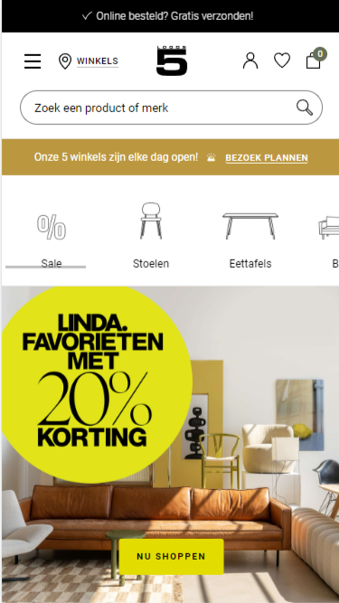

  #### Screenshot(s) van de tweede pagina (small screen):
  Productpagina HKliving vaas Ceramic Espresso L  
  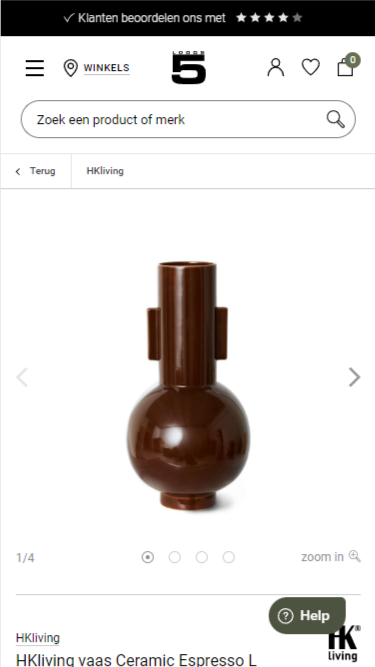
 

## Toegankelijkheidstest 1/2 (week 1)

  
uitwerken na test in 2e werkgroep

  ### Bevindingen
  Lijst met je bevindingen die in de test naar voren kwamen:
  
  * Er wordt vaak alleen 'koppeling' gezegd.
  
  * Heel veel error en de 'lang' is leeg.
  
  * Slaat soms dingen over.
  
  * Knoppen links en rechts kunnen wel wat groter, zeker voor mensen met slechter zicht.
  
  * H1 is een svg maar staat niet als een H1 genoemd, verder wordt aleen gebruik gemaakt van h2, h3 en h4.
  
  * Er wordt alleen gebruik gemaakt van ul (en dus ook li).
  
  * Standaard foto's hebben een simpele alt tekst, banners en tekst afbeeldingen worden niet met een alt tekst omschreven.
  
  * Video's worden automatisch en muted afgespeeld maar worden niet genoemd.

## Breakdownschets (week 1)

  
uitwerken na afloop 3e werkgroep

  ### de hele pagina: 
  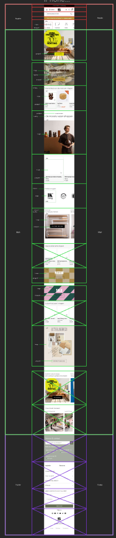

  ### dynamisch deel (bijv menu): 
  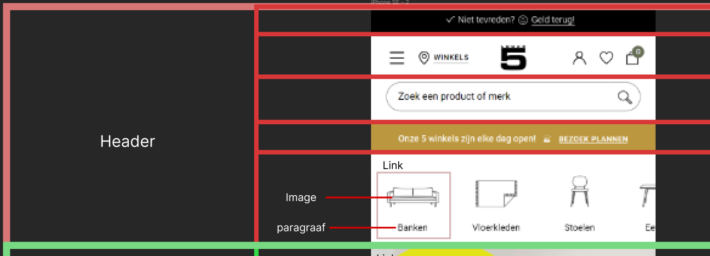

  ### wellicht nog een dynamisch deel (bijv filter): 
  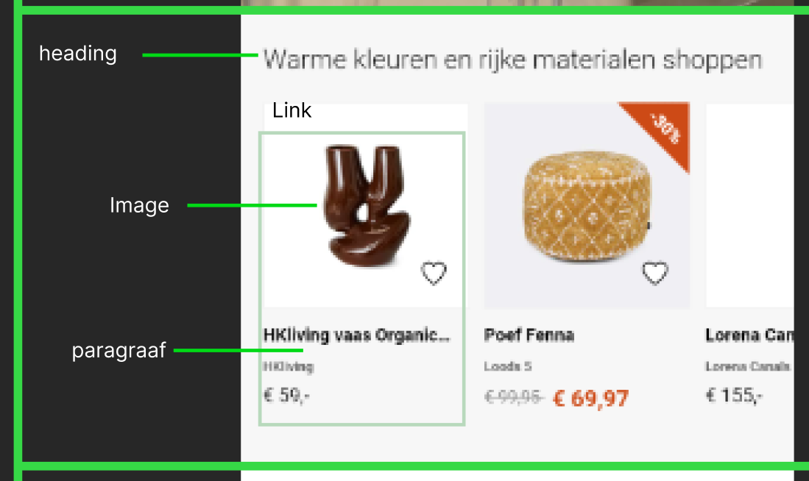

## Voortgang 1 (week 2)

  
uitwerken voor 1e voortgang

  ### Stand van zaken
  hier dit ging goed & dit was lastig (neem ook screenshots op van delen van je website en code)
  * De opdrachten gingen over het algemeen best goed, soms moest ik even iets opnieuw doen omdat ik iets verkeerd geschreven had of ergens overheen had gelezen.
  * Zelf de html en css van mijn eigen website schrijven vind ik dan weer moeilijker. Ik denk omdat ik niet altijd even goed weet wat ik moet doen om het gewenste eindwerk te krijgen.
  * Ik ben nu vooral bezig geweest met een beetje de basis neer te zetten. 
    De html is nog niet helemaal zoals het moet (omdat ik de breakdownschets niet helemaal goed had gemaakt), en de css is nu nog best rommerling.
    Ik wil hier dit weekend even goed voor zitten om deze op orde te krijgen.

  ### Agenda voor meeting
  samen met je groepje opstellen

  * Student 1 (Meike)
    - SVG viewport in html en goede svg css

  

  ### Verslag van meeting
  hier na afloop snel de uitkomsten van de meeting vastleggen

  - Sections veranderen naar articles en andersom (indien nodig)
  - Media query toevoegen
  - SVG paths omzetten in images

## Voortgang 2 (week 3)

  
uitwerken voor 2e voortgang

  ### Stand van zaken
  hier dit ging goed & dit was lastig (neem ook screenshots op van delen van je website en code)
  * Ik heb de feedback van vorige week verwerkt, ik moest hierdoor wel overnieuw beginnen met mijn css, omdat ik geen overzicht meer had van wat iets was.
  * Ik heb nu weer niet hele goed overzicht in mijn css, ik ga meer notities toevoegen per onderdeel zodat ik niet steeds in mijn css hoef te kijken wat ik met welke regel aanspreek.
  * Ik heb sommige dingen al met desktop grootte in gedachte gedaan ipv met mobile grootte. Ik moet deze dingen gaan aanpassen om het voor mezelf ook makkelijker en overzichtelijker te houden.
  * Ik moet sommige oefeningen die ik tijdens de les heb gemaakt opnieuw doen en naar de uitleg kijken. Tijdens de les gingen de opdrachten over het algemeen erg goed, maar het zelf toepassen op mijn eigen site vind ik soms nog wel lastig.

  ### Agenda voor meeting
  samen met je groepje opstellen

  * Student 1 (Meike): 
    - Waarom werkt mijn media query alleen als ie onder aan de pagina staat?
    - Is het handig om meedere media queries te maken voor verschillende onderdelen van de pagina?
    
    (reminders voor mezelf!)
    - Hoe zorg ik voor meer overzicht in mijn html en css?
    - Moet ik mijn css aanpassen? (sommige dingen staan op desktop-first ipv op mobile-first)
    - Bronnen toevoegen
    - Breakdown schets goed (af)maken 

  ### Verslag van meeting
  hier na afloop snel de uitkomsten van de meeting vastleggen

  - Werk met meerdere media queries. Zet ze onder het stuk CSS wat je ermee wil veranderen. Anders werkt de media query niet.
  - Ik heb mijn css aangepast zodat het er iets overzichtelijker uitziet.
  - Ik heb mijn breakdownschets verbeterd.

## Toegankelijkheidstest 2/2 (week 4)

  
uitwerken na test in 9e werkgroep

  ### Bevindingen
  Lijst met je bevindingen die in de test naar voren kwamen (geef ook aan wat er verbeterd is):
  
  * Er wordt nu ook verteld wat voor koppeling.
  
  * Geen errors meer en er staat een taal in de lang.
  
  * Zegt nu hoeveel items er in de ul staan
  
  * Slaat nog steeds wel eens dingen over, maar niet zoveel als eerst.
  
  * Sommige buttons zijn soms wat klein (En niet alles is klikbaar, ik ben een paar keer per ongeluk een a vergeten).
  
  * Knoppen links en rechts weggehaald.
  
  * Alle foto's hebben een alt text (ook al kunnen sommige wel wat beter maar ik ben slecht in omschrijven).
  
  * Video's worden nog automatisch en muted afgespeeld maar worden niet genoemd, maar ze voegen ook niet echt iets toe aan de context van de pagina.
  
  * Ik heb nog geen focus state, etc.
  
  * Ik heb (nog geen) dark/light/high contrast modes.

## Voortgang 3 (week 4)

  
uitwerken voor 3e voortgang

  ### Stand van zaken
  hier dit ging goed & dit was lastig (neem ook screenshots op van delen van je website en code)

  ### Agenda voor meeting
  samen met je groepje opstellen

  * Student 1 (Meike): 
    - Hoe maak ik een caroussel voor mijn foto's?
    - Hamburger menu lukt niet helemaal.

  ### Verslag van meeting
  hier na afloop snel de uitkomsten van de meeting vastleggen

  - Ik heb een filmpje gezocht waar duidelijk in word uitgelegd hoe je een caroussel moet maken.
  - Ik heb onderzoek gedaan naar een hamburgermenu
  - Ik heb onderzoek gedaan naar (werkende) searchbars en de javascript. 
  - Ik heb onderzoek gedaan naar een accordion en de javascript.

## Eindgesprek (week 5)

  
uitwerken voor eindgesprek

  ### Je uitkomst - karakteristiek screenshots:
  

  ### Dit ging goed/Heb ik geleerd: 
  - Ik heb geleerd hoe ik fatsoenlijk met grid en flex kan werken. Ik vond het ook leuk om hiermee te klooien van mobile naar desktop design.

  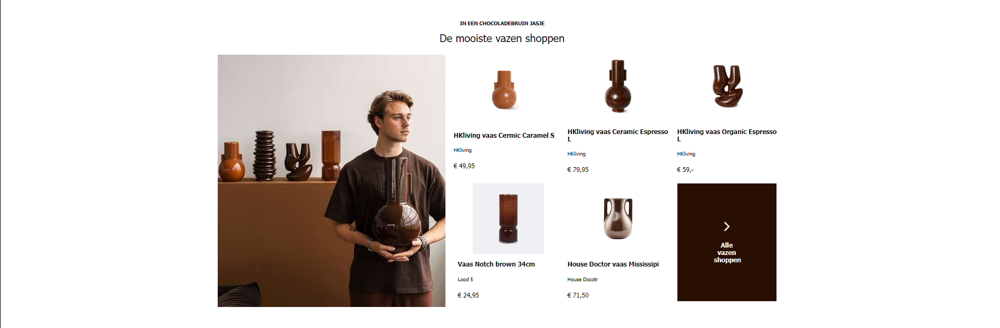
  
  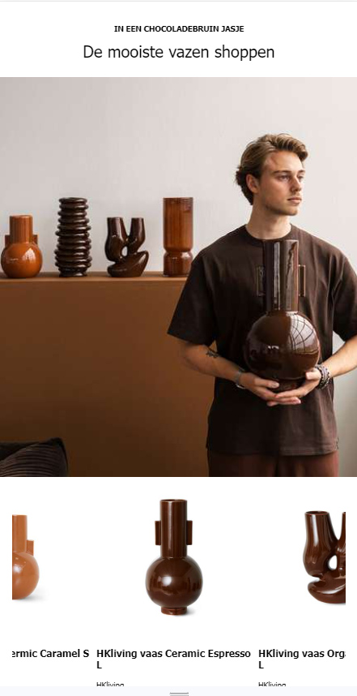

  ### Dit was lastig/Is niet gelukt:
  - Het is mij uiteindelijk helaas niet meer gelukt om een werkende hamburgermenu te maken. Hij werkt wel met als mijn scherm een bepaalde grootte   is dat het een afbeelding is of juist tekst, maar als je op de afbeelding klikt opent er niks. Ik heb mijn header een beetje te ingewikkeld       geschrevem waardoor ik hoet moeilijk vond om uiteindelijk het zo te krijgen zoals ik wil.
  
    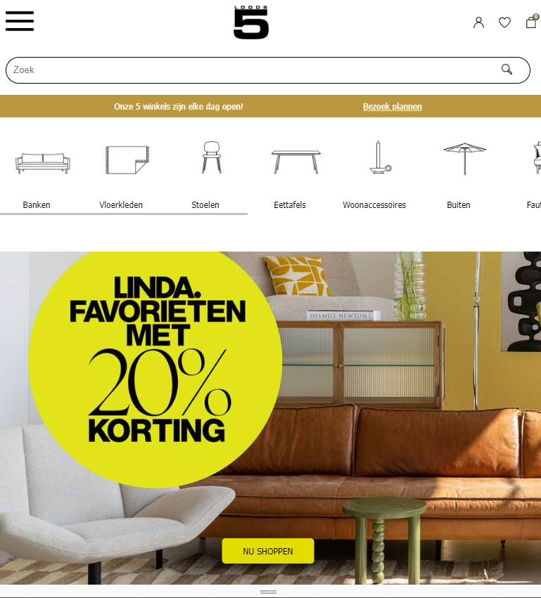
  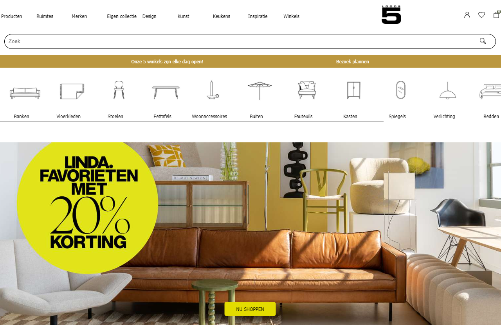
  
  - Ik heb bij mijn productpagina niet goed gekeken naar het verschil in lay-out tussen de mobile versie en de desktop versie. Hierdoor ziet mijn     desktop versie er een beetje raar uit, omdat ik deze niet meer goed kon stylen, maar ik had ook geen tijd meer om opnieuw mijn html en css voor   de pagina te schrijven.
  
    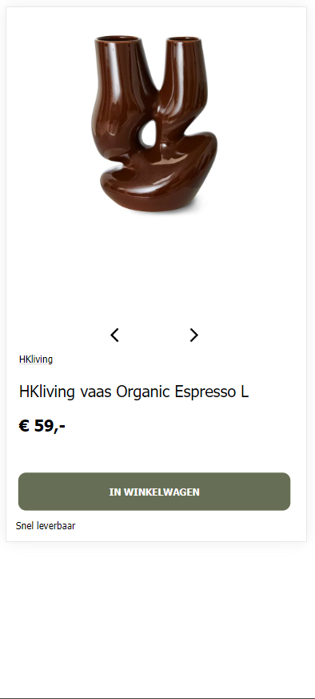
  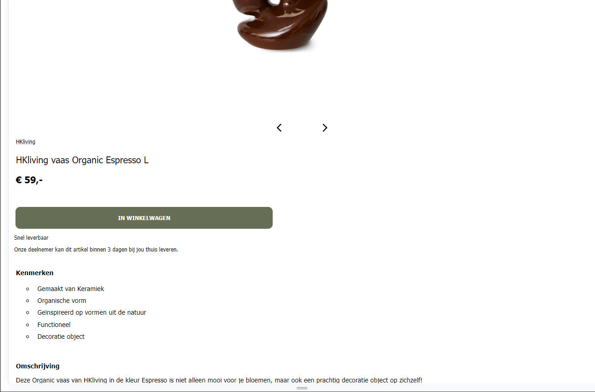
  
  - Ik hen het voor mezelf best moeilijk gemaakt omdat ik geen duidelijke css heb geschreven (ik heb te laat aanttekeningen toegevoegd), waardoor     het moeilijk was om te bepalen wat nou wat was en ik dingen door elkaar ging zetten.

  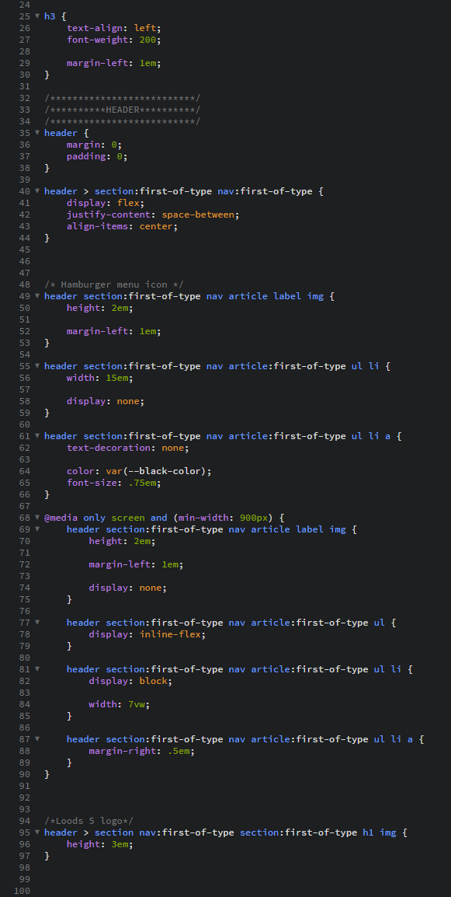
  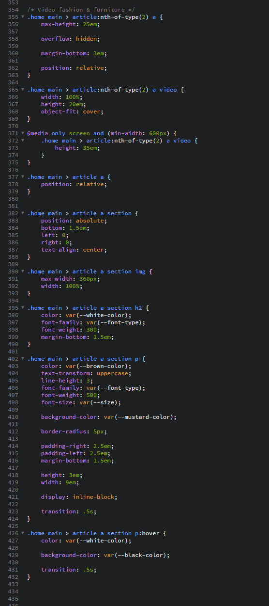

## Bronnenlijst

  
continu bijhouden terwijl je werkt

  Nb. Wees specifiek ('css-tricks' als bron is bijv. niet specifiek genoeg). 
  Nb. ChatGpT en andere AI horen er ook bij.
  Nb. Vermeld de bronnen ook in je code.

  1. https://www.svgviewer.dev/svg-to-png (svg to png)
  2. https://codepen.io/alvarotrigo/pen/MWEJEWG (hamburger menu)
  3. https://www.youtube.com/watch?v=9hnJsNIBq1g (plaatje in searchbar)
  4. https://www.youtube.com/watch?v=flItyHiDm7E (hamburger menu)
  5. https://www.youtube.com/watch?v=dPLHi7tsoFU  (accordion)
  6. https://www.geeksforgeeks.org/search-bar-using-html-css-and-javascript/ (searchbar)
  7. https://stackoverflow.com/questions/75572900/adding-keywords-to-search-bar-in-javascript (searchbar)

